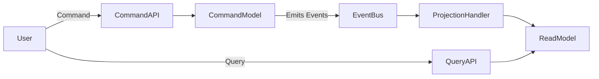

# CQRS: Command Query Responsibility Segregation

**CQRS (Command Query Responsibility Segregation)** is an architectural design pattern that separates **read** and **write** operations for a data store into **distinct models**.

Instead of using a single model to handle all responsibilities, CQRS divides the system into two clear parts:

- **Commands**: actions that *change* state (create, update, delete)
- **Queries**: requests that *read* data without modifying it

This separation allows each side to be optimized independently, leading to better **performance**, **scalability**, and **maintainability**, especially in systems with complex business logic and high traffic.

---

## Background Concepts

### why use CQRS and not a simple CRUD ?

A traditional **C**reate, **R**ead, **U**pdate, **D**elete (CRUD) application uses a **single data model** for both reading and writing. This approach works well for simple applications. However, as the system grows in complexity, several issues arise:

- The same model serves **conflicting purposes**
  - Normalized for writes
  - Denormalized for reads
- Read and write operations compete for the **same resources**
- Reads cannot be scaled independently from writes
- Business logic becomes tightly coupled with data access logic
- Performance bottlenecks appear when read/write patterns differ significantly

As a result, the system becomes harder to evolve and maintain.

---

## Core Architecture of CQRS

CQRS addresses these limitations by clearly separating responsibilities.

### Command Side (Write Model)

The **command side** is responsible for all state changes.

- Handles create, update, and delete operations
- Enforces business rules and invariants
- Executes domain logic
- Publishes domain events
- Optimized for **consistency and correctness**

Commands do **not** return data. They only indicate success or failure.

---

### Query Side (Read Model)

The **query side** focuses exclusively on data retrieval.

- Handles all read operations
- Optimized for specific use cases and views
- Often denormalized for fast reads
- Can use a different database or storage technology
- Usually **eventually consistent**

Queries never change state.

---

### Synchronization Layer

Because the read and write models are separate, they must be synchronized.

This is typically achieved using:

- Domain events
- Event buses or message queues
- Projection handlers that update read models

This layer reacts to events emitted by the command side and updates the query side accordingly.

---

## High-Level CQRS Flow

## when to use crqs and when not : 

Use CQRS when:

- You have complex domain logic
- You need to scale reads independently
- Different consumers require different data views
- You are building an event-driven system

Avoid CQRS when:
- The application is simple
- Strong consistency is required everywhere

