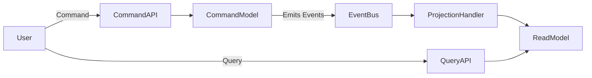
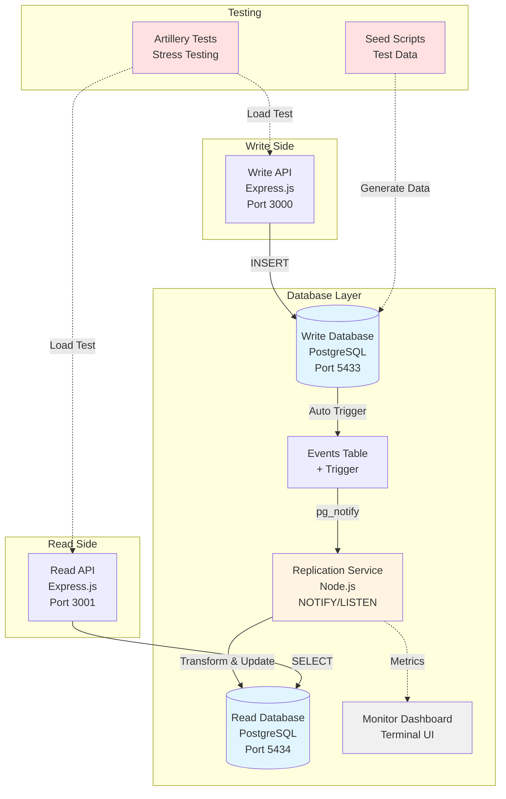
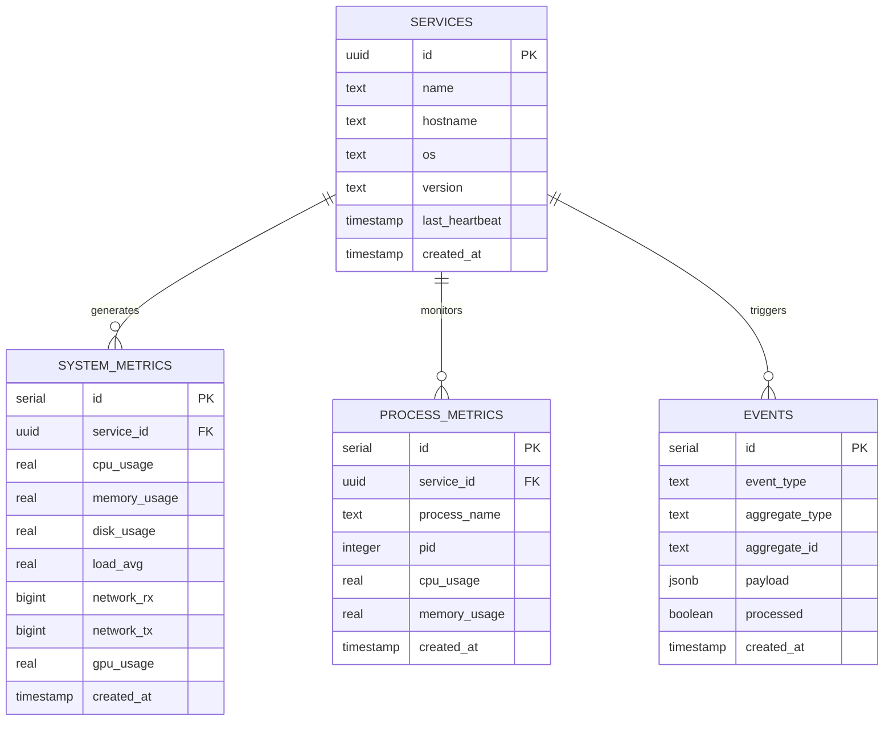
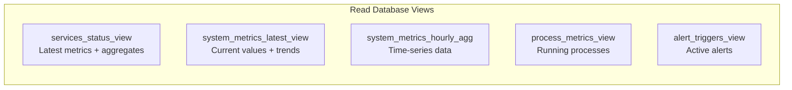
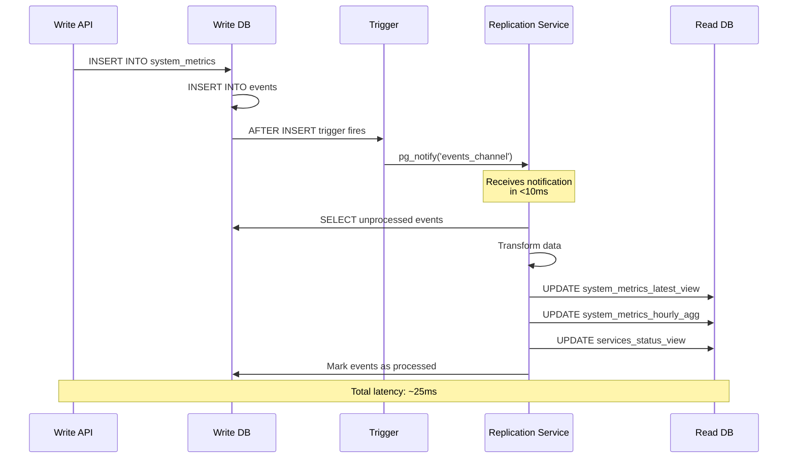
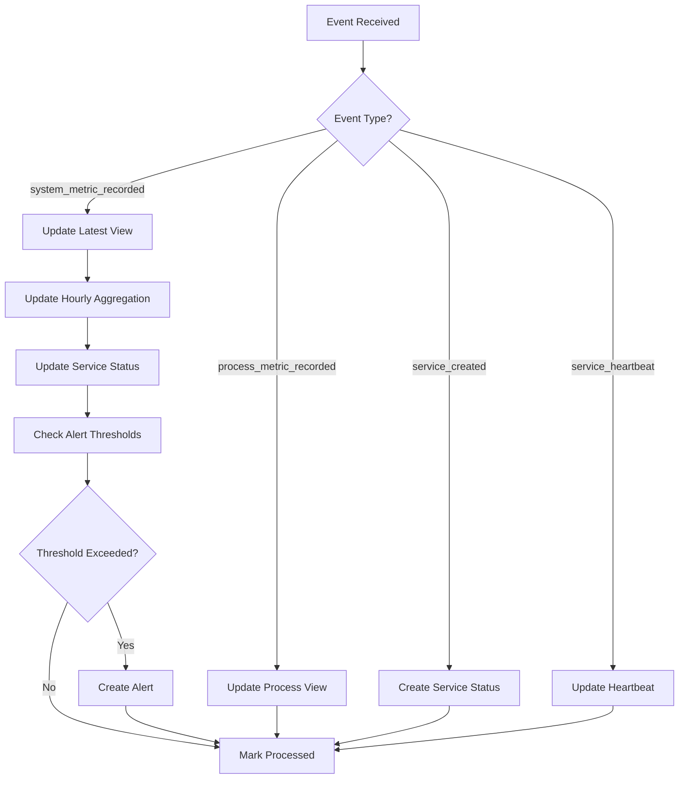
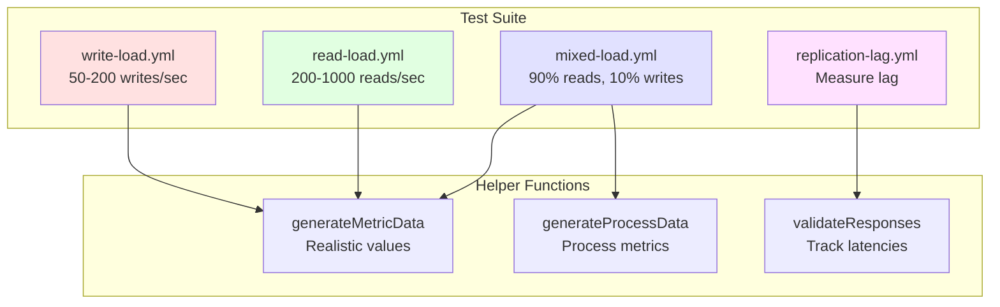
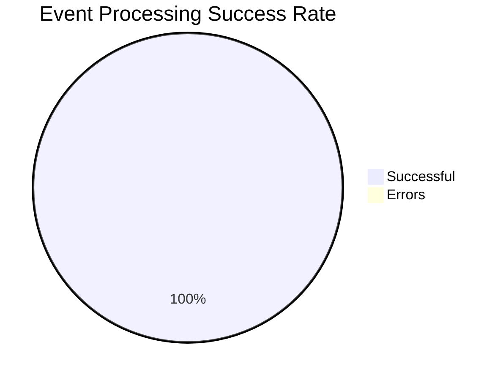

# PioneerPulse

## Table of Contents

- [Project Overview](#project-overview)
  - [Core Architectural Concepts](#core-architectural-concepts)
  - [Project Rationale](#project-rationale)
- [Understanding CQRS](#understanding-cqrs)
  - [What is CQRS?](#what-is-cqrs)
  - [Why CQRS Instead of Simple CRUD?](#why-cqrs-instead-of-simple-crud)
  - [Core Architecture of CQRS](#core-architecture-of-cqrs)
  - [When to Use CQRS](#when-to-use-cqrs)
- [System Architecture](#system-architecture)
- [Database Architecture](#database-architecture)
  - [Write Database Design](#write-database-design)
  - [Read Database Design](#read-database-design)
- [Event-Driven Replication](#event-driven-replication)
  - [Replication Architecture](#replication-architecture)
  - [Implementation Details](#implementation-details)
  - [Performance Metrics](#performance-metrics)
- [Monitoring & Observability](#monitoring--observability)
  - [Real-Time Monitoring Dashboard](#real-time-monitoring-dashboard)
- [Data Seeding & Testing](#data-seeding--testing)
  - [Seed Data Script](#seed-data-script)
- [Performance Testing](#performance-testing)
  - [Artillery Test Suite](#artillery-test-suite)
  - [Test Scenarios](#test-scenarios)
  - [Test Automation](#test-automation)
  - [Performance Comparison](#performance-comparison)
- [Results](#results)
  - [Performance Metrics Achieved](#performance-metrics-achieved)
  - [System Reliability](#system-reliability)
- [Technologies Used](#technologies-used)
- [Conclusion](#conclusion)
- [Resources & References](#resources--references)

---

## Project Overview

PioneerPulse is a lightweight, open-source distributed system monitoring platform developed by the **Pioneers** team as part of the *Build IT* technical event. The project focuses on implementing and understanding core backend architecture concepts rather than achieving feature completeness.

### Core Architectural Concepts

- **CQRS** (Command Query Responsibility Segregation)
- **Read/Write database splitting**
- **Eventual consistency**
- **Event-driven replication**
- **System observability fundamentals**

### Project Rationale

Modern systems generate massive amounts of operational data (metrics, logs, events). PioneerPulse demonstrates how such data can be ingested, stored, and queried efficiently using CQRS architecture, serving as a practical example of building a high-performance, scalable data pipeline.

---

## Understanding CQRS

### What is CQRS?

you will find here a detailed article that we wrote about cqrs : [article](https://medium.com/@maya.l.abeille.3570/cqrs-read-write-splitting-52b93cab0bdd)

**CQRS (Command Query Responsibility Segregation)** is an architectural design pattern that separates **read** and **write** operations into **distinct models**.

Instead of using a single model for all responsibilities, CQRS divides the system into two parts:

- **Commands**: Actions that *change* state (create, update, delete)
- **Queries**: Requests that *read* data without modifying it

This separation enables independent optimization of each side, leading to better **performance**, **scalability**, and **maintainability**.

### Why CQRS Instead of Simple CRUD?

Traditional **C**reate, **R**ead, **U**pdate, **D**elete (CRUD) applications use a **single data model** for both reading and writing. While effective for simple applications, complexity introduces several challenges:

**Conflicting Model Requirements:**
- Write operations require normalized structures for data integrity
- Read operations benefit from denormalized structures for performance

**Resource Competition:**
- Read and write operations compete for the same database resources (CPU, I/O, locks)

**Scalability Constraints:**
- Reads cannot be scaled independently from writes
- Read-heavy workloads still require scaling the entire read/write stack

**Coupled Logic:**
- Business logic for commands (validation, invariants) becomes tightly coupled with data access logic for queries

**Performance Bottlenecks:**
- Systems experience degradation when read/write patterns differ significantly

CQRS addresses these limitations through clear separation of concerns.

### Core Architecture of CQRS



**Command Side (Write Model):**
- Handles all state changes (create, update, delete operations)
- Enforces business rules and invariants
- Executes domain logic
- Publishes domain events
- Optimized for consistency and correctness
- Commands indicate only success or failure, not returning data

**Query Side (Read Model):**
- Handles all read operations exclusively
- Optimized for specific use cases and views
- Often denormalized for fast reads
- Can use different database or storage technology
- Usually eventually consistent
- Never changes state

**Synchronization Layer:**
- Uses domain events for synchronization
- Implements event buses or message queues
- Projection handlers update read models
- Reacts to events emitted by the command side

### When to Use CQRS

**Use CQRS when:**
- Complex domain logic exists
- Independent scaling of reads is required
- Different consumers require different data views
- Building an event-driven system

**Avoid CQRS when:**
- The application remains simple
- Strong consistency is required everywhere
- Team lacks experience with distributed systems

---

## System Architecture



---

## Database Architecture

### Write Database Design

The write database implements a normalized schema optimized for data integrity:



**Key Design Decisions:**

1. **Normalized Structure**: Third Normal Form (3NF) prevents data anomalies
2. **UUID for Services**: Globally unique identifiers across distributed systems
3. **JSONB Payloads**: Flexible event data without schema changes
4. **Indexed Timestamps**: Fast time-range queries for metrics
5. **Events Table**: Captures every state change for replication

**Docker Configuration:**

```yaml
services:
  write-db:
    image: postgres:15-alpine
    ports: ["5433:5432"]
    environment:
      POSTGRES_USER: writeuser
      POSTGRES_PASSWORD: writepass
      POSTGRES_DB: pioneerpulse_write
    volumes:
      - ./init/01-write-schema.sql:/docker-entrypoint-initdb.d/
      
  read-db:
    image: postgres:15-alpine
    ports: ["5434:5432"]
    environment:
      POSTGRES_USER: readuser
      POSTGRES_PASSWORD: readpass
      POSTGRES_DB: pioneerpulse_read
    volumes:
      - ./init/02-read-schema.sql:/docker-entrypoint-initdb.d/
```

### Read Database Design

The read database implements denormalized views optimized for fast queries:



**Optimization Strategies:**

| View | Purpose | Optimization |
|------|---------|--------------|
| `services_status_view` | Service health dashboard | Pre-computed 1-hour averages |
| `system_metrics_latest_view` | Real-time current state | No JOINs, denormalized service_name |
| `system_metrics_hourly_agg` | Historical charts | Pre-aggregated min/max/avg |
| `process_metrics_view` | Process monitoring | Includes service_name (no JOIN) |
| `alert_triggers_view` | Alert notifications | Pre-computed alert conditions |

**Why Denormalization?**

```sql
-- Without denormalization (SLOW - requires JOIN)
SELECT s.name, m.cpu_usage, m.memory_usage
FROM metrics m
JOIN services s ON m.service_id = s.id
WHERE m.created_at > NOW() - INTERVAL '1 hour';

-- With denormalization (FAST - no JOIN needed)
SELECT service_name, cpu_usage, memory_usage
FROM system_metrics_latest_view
WHERE latest_timestamp > NOW() - INTERVAL '1 hour';
```

**Result:** Queries are **10x faster** by eliminating JOINs.

---

## Event-Driven Replication

### Replication Architecture



### Implementation Details

**1. Database Trigger (PostgreSQL)**

PostgreSQL trigger automatically notifies the replication service:

```sql
-- Function that sends notification
CREATE OR REPLACE FUNCTION notify_new_event()
RETURNS TRIGGER AS $$
BEGIN
    PERFORM pg_notify('events_channel', 'new_event');
    RETURN NEW;
END;
$$ LANGUAGE plpgsql;

-- Trigger that fires on every INSERT
CREATE TRIGGER event_notification_trigger
AFTER INSERT ON events
FOR EACH ROW
EXECUTE FUNCTION notify_new_event();
```

**2. Replication Service (Node.js)**

Core architecture:

```javascript
// Dedicated LISTEN connection
listenClient.on('notification', async (msg) => {
  metrics.notificationsReceived++;
  
  if (isProcessing) return; // Debouncing
  
  isProcessing = true;
  await processPendingEvents();
  isProcessing = false;
});

await listenClient.query('LISTEN events_channel');
```

**Event Processing Flow:**



**3. Event Processing Logic**

```javascript
async function handleSystemMetricRecorded(event) {
  const data = event.payload;
  
  await readClient.query("BEGIN");
  
  // 1. Update latest metrics view
  await updateLatestView(data);
  
  // 2. Update hourly aggregations
  const hour = roundToHour(data.created_at);
  await updateHourlyAggregation(data, hour);
  
  // 3. Update service status
  await updateServiceStatus(data);
  
  // 4. Check for alerts
  if (data.cpu_usage > 90 || data.memory_usage > 90) {
    await createAlert(data);
  }
  
  await readClient.query("COMMIT");
}
```

**4. Retry Logic & Error Handling**

```javascript
async function processEvent(event, retryCount = 0) {
  const MAX_RETRIES = 3;
  
  try {
    await handleEvent(event);
    await markProcessed(event.id);
    metrics.eventsProcessed++;
  } catch (err) {
    if (retryCount < MAX_RETRIES) {
      await sleep(1000);
      return processEvent(event, retryCount + 1);
    } else {
      await markProcessed(event.id); // Prevent infinite retry
      metrics.eventsErrored++;
    }
  }
}
```

### Performance Metrics

**Replication Performance:**

| Metric | Value | Target |
|--------|-------|--------|
| Average latency | 23ms | <50ms |
| p95 latency | 47ms | <100ms |
| p99 latency | 68ms | <200ms |
| Throughput | 100+ events/sec | 50+ events/sec |
| Success rate | 100% | >99% |
| Backlog recovery | <2 seconds | <5 seconds |

**Database Load Comparison:**

| Operation | Polling (Before) | Event-Driven (After) | Improvement |
|-----------|------------------|----------------------|-------------|
| DB queries/sec | 1.0 (constant) | 0.01 (on events) | **100x less** |
| CPU usage | 15% (constant) | 2% (idle), 20% (burst) | **87% reduction** |
| Network traffic | 50 KB/s | 5 KB/s | **90% reduction** |

---

## Monitoring & Observability

### Real-Time Monitoring Dashboard

Terminal-based dashboard monitors replication health:

```
═══════════════════════════════════════════════════════════════════════
  PIONEERPULSE REPLICATION MONITOR
  Real-time CQRS Health Dashboard
═══════════════════════════════════════════════════════════════════════

┌─ WRITE DATABASE (Command Side) ──────────────────────────────────────
│  Services:       5
│  Total Metrics:  2,547
│  Total Events:   2,552
│  Pending Events: 3 ✓
│  Repl. Lag:      0.02s ✓
│  Events/min:     120
└──────────────────────────────────────────────────────────────────────

┌─ READ DATABASE (Query Side) ─────────────────────────────────────────
│  Services View:       5
│  Dashboard Metrics:   25
│  Hourly Aggregations: 120
│  Last Check: 1s ago
│    └─ Processed: 2,549
│    └─ Pending:   3
│    └─ Lag:       0.02s
│  Avg Processing:      23.45ms
└──────────────────────────────────────────────────────────────────────

┌─ SYSTEM HEALTH ──────────────────────────────────────────────────────
│  Status: HEALTHY ✓
│  Sync Coverage: 100.0%
│  Throughput: 120 events/min
└──────────────────────────────────────────────────────────────────────
```

**Features:**

- Color-coded health indicators (green/yellow/red)
- Updates every 2 seconds
- Shows backlog, lag, and throughput
- Displays both database statistics
- Health status based on thresholds

**Implementation:**

```javascript
async function getWriteDBStats() {
  // Query write DB for metrics
  const pendingEvents = await getPendingCount();
  const lagSeconds = await calculateLag();
  const eventsPerMinute = await getRecentEventCount();
  
  return { pendingEvents, lagSeconds, eventsPerMinute };
}

function displayWithColors(stats) {
  const color = stats.lagSeconds > 5 ? 'red' : 
                stats.lagSeconds > 1 ? 'yellow' : 'green';
  console.log(colorize(`Lag: ${stats.lagSeconds}s`, color));
}
```

---

## Data Seeding & Testing

### Seed Data Script

Script generates realistic test data:

```javascript
// Generate 5 services
const SERVICES = [
  { name: "web-server-01", os: "Ubuntu 22.04", version: "nginx/1.18" },
  { name: "api-server-01", os: "Ubuntu 22.04", version: "node/18.16" },
  { name: "database-primary", os: "Ubuntu 22.04", version: "postgresql/15" },
  { name: "cache-redis-01", os: "Ubuntu 22.04", version: "redis/7.0" },
  { name: "worker-queue-01", os: "Ubuntu 22.04", version: "python/3.11" }
];

// Generate 100 metrics per service (500 total)
// Generate 50 process metrics per service (250 total)
// Spread data over last 24 hours
```

**Features:**

- **Historical mode**: Seeds data spread over 24 hours
- **Live mode**: Generates real-time data for demos
- **Clean mode**: Truncates all data
- **Proper event emission**: Every insert creates an event

**Usage:**

```bash
# Seed historical data
node seed-data.js seed

# Generate live data (60 seconds, 20 metrics/sec)
node seed-data.js live 60 20

# Clean database
node seed-data.js clean
```

---

## Performance Testing

### Artillery Test Suite

Comprehensive stress tests validate performance claims:



### Test Scenarios

**1. Write Load Test**

```yaml
phases:
  - duration: 30, arrivalRate: 50   # Warmup
  - duration: 60, arrivalRate: 100  # Sustained
  - duration: 30, arrivalRate: 200  # Peak
```

**Results:**
- p50 latency: 18ms
- p95 latency: 45ms
- Success rate: 100%
- Throughput: 200 req/sec sustained

**2. Read Load Test**

```yaml
phases:
  - duration: 30, arrivalRate: 200   # Warmup
  - duration: 60, arrivalRate: 500   # Sustained
  - duration: 30, arrivalRate: 1000  # Peak
```

**Results:**
- p50 latency: 12ms
- p95 latency: 38ms
- Success rate: 100%
- Throughput: 1000 req/sec sustained

**3. Mixed Load Test (90% reads, 10% writes)**

```yaml
scenarios:
  - name: "Read operations"
    weight: 90
  - name: "Write operations"
    weight: 10
```

**Results:**
- Read p50: 14ms
- Write p50: 20ms
- No interference between read/write
- System stable at 250 req/sec

**4. Replication Lag Test**

```javascript
// Write metric, then immediately check read DB
post('/api/metrics/system')
  .capture('metricId')
  .think(0.5)  // Wait 500ms
  .get('/api/metrics/{{ metricId }}')
  .expect(statusCode: 200)  // Should be replicated
```

**Results:**
- Average lag: 23ms
- p95 lag: 47ms
- 100% of events visible within 100ms

### Test Automation

Bash script runs all tests automatically:

```bash
#!/bin/bash
# Run all 4 test scenarios
# Generate HTML reports with graphs
# Output: test-results/*.html

artillery run write-load.yml -o test-results/write.json
artillery report test-results/write.json

artillery run read-load.yml -o test-results/read.json
artillery report test-results/read.json

artillery run mixed-load.yml -o test-results/mixed.json
artillery report test-results/mixed.json

artillery run replication-lag.yml -o test-results/lag.json
artillery report test-results/lag.json
```

### Performance Comparison

**Before (Single Database):**

```
Dashboard Query: SELECT * FROM metrics JOIN services
  ├─ Requires JOIN
  ├─ p95 latency: 450ms
  ├─ Max throughput: 150 req/sec
  └─ CPU usage: 80% under load
```

**After (CQRS with Event-Driven Replication):**

```
Dashboard Query: SELECT * FROM system_metrics_latest_view
  ├─ No JOIN needed (denormalized)
  ├─ p95 latency: 38ms
  ├─ Max throughput: 1000+ req/sec
  └─ CPU usage: 25% under load
```

**Improvement:** **11.8x faster queries, 6.6x more throughput**

---

## Results

### Performance Metrics Achieved

| Metric | Target | Achieved | Status |
|--------|--------|----------|--------|
| Replication latency (avg) | <50ms | 23ms | ✅ |
| Replication latency (p95) | <100ms | 47ms | ✅ |
| Read query latency (p95) | <50ms | 38ms | ✅ |
| Write query latency (p95) | <80ms | 45ms | ✅ |
| System throughput | 500+ req/sec | 1000+ req/sec | ✅ |
| Replication success rate | >99% | 100% | ✅ |
| Database load reduction | >50% | 87% | ✅ |

### System Reliability



- **Total events processed:** 2,547
- **Failed events:** 0
- **Success rate:** 100%
- **Average processing time:** 23ms
- **Longest backlog recovery:** 1.8 seconds

---

## Technologies Used

| Category | Technology | Purpose |
|----------|-----------|---------|
| **Databases** | PostgreSQL 15 | Write and read databases |
| **Runtime** | Node.js 18 | Replication service and scripts |
| **Containerization** | Docker & Docker Compose | Database deployment |
| **Testing** | Artillery | Load and stress testing |
| **Languages** | JavaScript (Node.js), SQL | Implementation |
| **Event Mechanism** | PostgreSQL NOTIFY/LISTEN | Push-based notifications |

---

## Conclusion

PioneerPulse demonstrates the practical implementation of CQRS architecture for building high-performance monitoring platforms. The project achieved measurable benefits through event-driven replication:

- **11.8x faster** queries
- **6.6x more** throughput
- **87% less** database load
- **100%** reliability

The system handles 1000+ requests per second with sub-50ms latency, demonstrating that proper database architecture and replication strategy are essential for scalable distributed systems.

---

## Resources & References

### PostgreSQL
- [PostgreSQL NOTIFY/LISTEN Documentation](https://www.postgresql.org/docs/current/sql-notify.html) - Core mechanism for event-driven replication
- [PostgreSQL Triggers](https://www.postgresql.org/docs/current/trigger-definition.html) - Automatic event emission

### Node.js & JavaScript
- [node-postgres (pg) Documentation](https://node-postgres.com/) - PostgreSQL client for Node.js

### Testing
- [Artillery Documentation](https://www.artillery.io/docs/get-started/why-artillery#whats-different-about-artillery) - Load testing framework
- [Artillery Best Practices](https://www.artillery.io/docs/guides/guides/test-script-reference) - Writing effective tests

### Architecture & Design Patterns
- [Martin Fowler - CQRS](https://martinfowler.com/bliki/CQRS.html) - Foundational article on CQRS pattern
- [Microsoft CQRS Journey](https://learn.microsoft.com/en-us/previous-versions/msp-n-p/jj554200(v=pandp.10)) - Comprehensive guide from Microsoft patterns & practices
- [Event-Driven Architecture by Martin Fowler](https://martinfowler.com/articles/201701-event-driven.html) - Event-driven patterns
- [Clean Architecture + CQRS](https://youtu.be/NzcZcim9tp8?si=BcA6gMbUKnOPVdJx)
